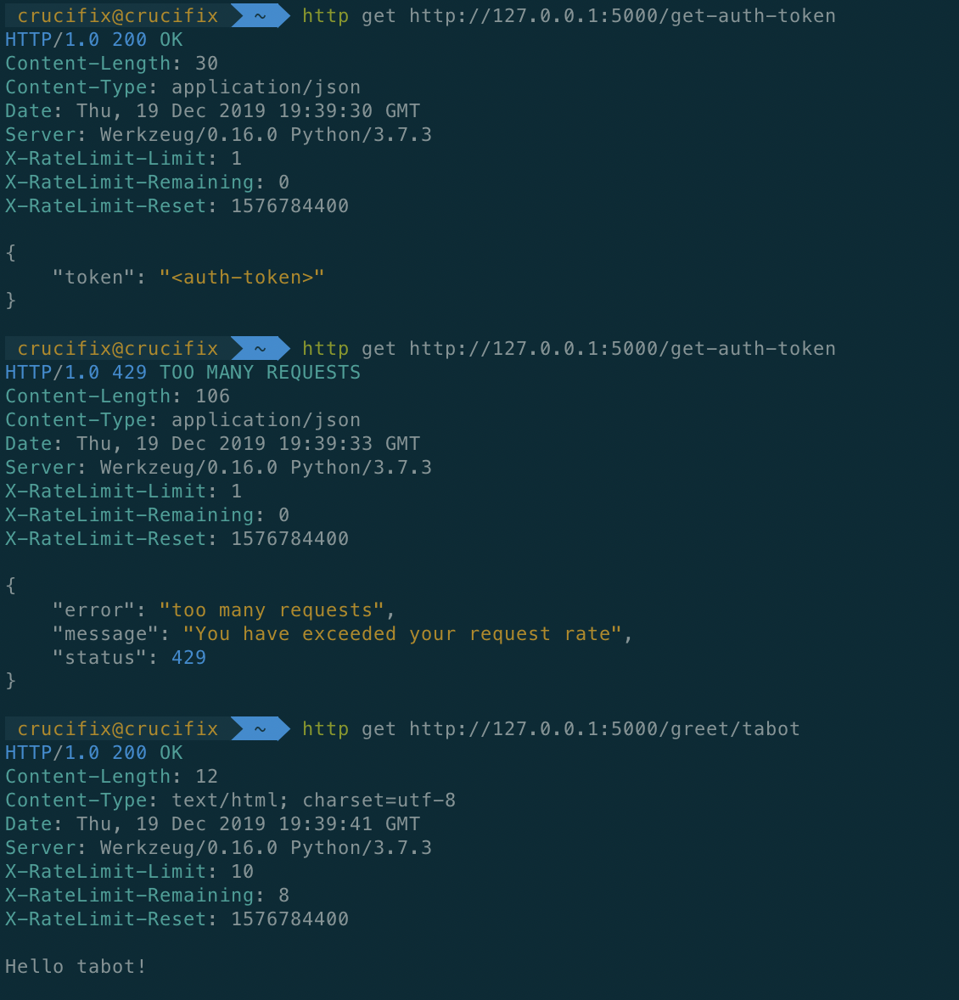

# Flask_Limit

[](https://github.com/tabotkevin/flask_limit/actions)

An extension that provides rate limiting for Flask routes.

## Installation

The easiest way to install this is through pip.

```shell
pip install Flask_Limit
```

## Configuration

This extension depends on two configuration parameters **RATELIMITE_LIMIT** and **RATELIMIT_PERIOD**.
If this parameters are not set, default values of **10** and **20** are used respectively,
which represents the number of allowed requests(limit) within a given time(period).

## Basic Usage

The easiest way to rate limit the entire application is limit the application's before request method.
The **rate_limit** decorator can be called with or without the **litmit** and **period** paramters.
If this parameters are not provided, the values are gotten from the application's configuration.
In the example below, after rate limiting the **before_request** method, a get request to **/greet/<name>**
will show from the response headers that the rate limiting is working.

## In-Memory example

This example uses `MemRateLimit` which is the default Rate-Limiter.

```python
from flask import Flask, g
from flask_limit import RateLimiter

class Config:
	RATELIMIT_LIMIT = 10  # Number of allowed requests.
	RATELIMIT_PERIOD = 30  # Period in seconds.

app = Flask(__name__)
app.config.from_object(Config)
limiter = RateLimiter(app)

@app.before_request
@limiter.rate_limit
def before_request():
    pass

@app.after_request
def after_request(rv):
    headers = getattr(g, 'headers', {})
    rv.headers.extend(headers)
    return rv


@app.route('/greet/<name>')
def greet(name):
    return f'Hello {name}!'


if __name__ == '__main__':
    app.run()
```

## Redis example

This example uses `RedisRateLimit` as the Rate-Limiter.
Remember to set the `REDIS_URL` parameter in your configuration

```python
from flask import Flask, g
from flask_limit import RateLimiter

class Config:
    RATELIMIT_LIMIT = 10
    RATELIMIT_PERIOD = 30
    REDIS_URL = "redis://localhost:6379/0"


app = Flask(__name__)
app.config.from_object(Config)
limiter = RateLimiter(app, limiter="redis")


@app.before_request
@limiter.rate_limit
def before_request():
    pass


@app.after_request
def after_request(rv):
    headers = getattr(g, "headers", {})
    rv.headers.extend(headers)
    return rv


@app.route("/greet/<name>")
def greet(name):
    return f"Hello {name}!"


if __name__ == "__main__":
    app.run()
```

## Complex example

More than one route can be rate limited.

```python
from flask import Flask, g
from flask_limit import RateLimiter

class Config:
	RATELIMIT_LIMIT = 10
	RATELIMIT_PERIOD = 30

app = Flask(__name__)
app.config.from_object(Config)
limiter = RateLimiter(app)

@app.before_request
@limiter.rate_limit
def before_request():
    pass

@app.after_request
def after_request(rv):
    headers = getattr(g, 'headers', {})
    rv.headers.extend(headers)
    return rv


@app.route('/greet/<name>')
def greet(name):
    return f'Hello {name}!'


@app.route('/get-auth-token')
@limiter.rate_limit(limit=1, period=600)  # one call per 10 minute period
def get_auth_token():
    return {'token': '<auth-token>'}

if __name__ == '__main__':
    app.run()
```

## Tests

```shell
  python -m pip install --upgrade pip
  pip install tox tox-gh-actions

  tox
```

## Proof


